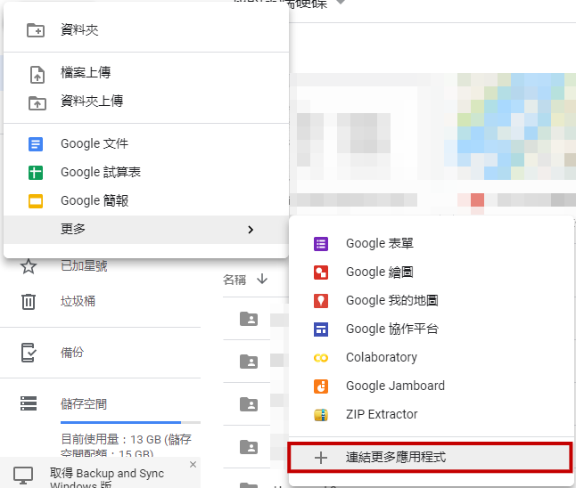
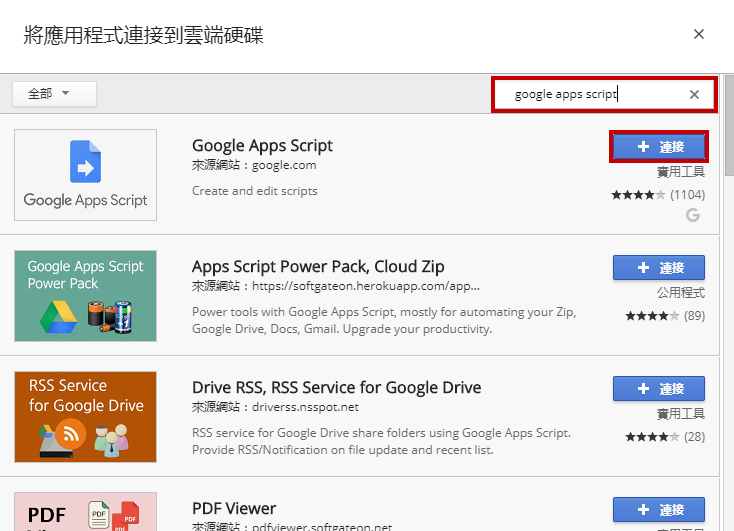
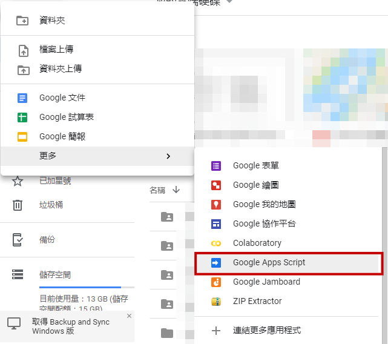
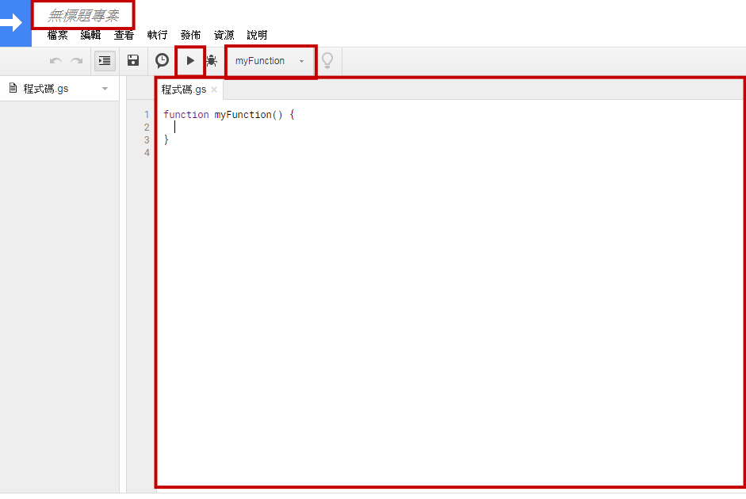
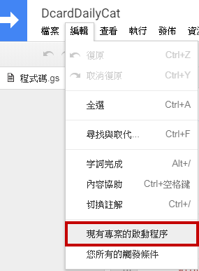
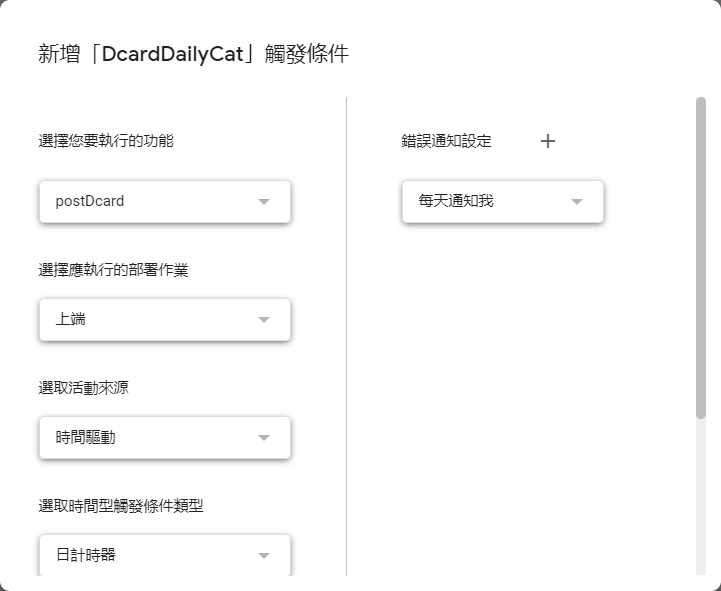
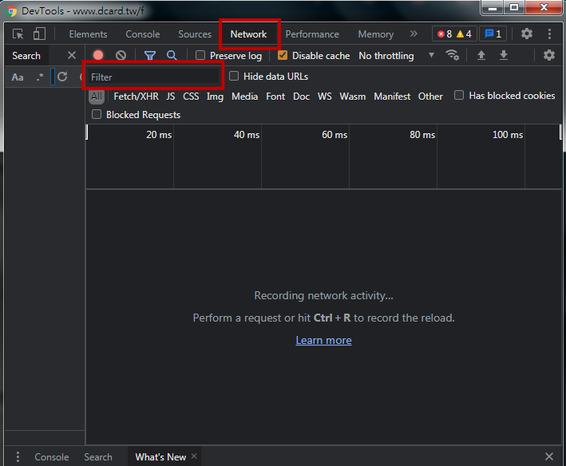
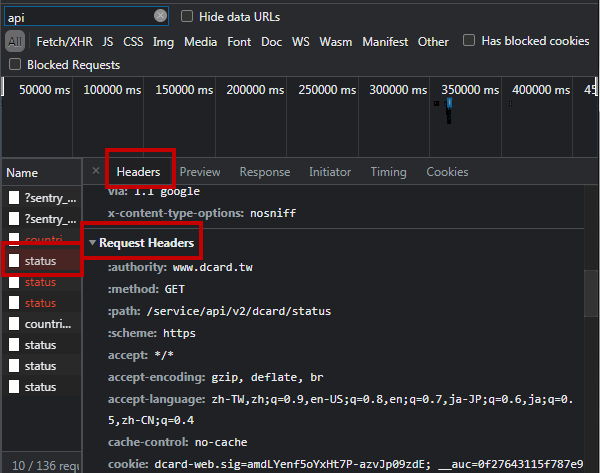

# DcardDailyCat
每天 PO 一隻隨機貓貓到 Dcard 的 小程式
  
---
  
簡單的排程發文機器人，  
也是 Google Apps Script、theCatAPI、Imgur API、Dcard API 範例。

僅供參考，請勿直接使用。

`[]`內皆為須自填的內容
  
---
  
## Google Apps Script
用來排程執行指定行為。  
（以下為早期截圖，懶得更新）

文件：  
https://developers.google.com/apps-script/reference/  
https://developers.google.com/apps-script/reference/url-fetch/


  
新增 > 更多 > 連結更多應用程式
<br><br>

  
搜尋 "Google Apps Script" > 連結
<br><br>

  
新增 > 更多 > Google Apps Script
<br><br>

  
（Google Apps Script 介面）
編輯程式碼  
（上方可以選要執行的主程式並執行）
<br><br>

  
編輯 > 現有專案的啟動程序
<br><br>

  
- 選擇您要執行的功能：（主程式名，例如：postDcard)
- 選取活動來源：來自日曆
- 選取時間型觸發條件類型：日計時器
- 選取時段：(自選，會在時段裡某個時間點執行)
  
---
  
## theCatAPI.com
取得一張隨機貓貓的圖片 URL

文件：  
https://docs.thecatapi.com/

程式碼：  
```javascript
function getRandomCat() {
  var url = 'https://api.thecatapi.com/v1/images/search?limit=1?size=%22full%22';
  var res = UrlFetchApp.fetch(url);
  
  return uploadToImgur(JSON.parse(res.getContentText())[0].url);
}
```
  
---
  
## Imgur API
將圖片 URL 上傳至 Imgur，並取得 Imgur 的圖片 URL。

文件：
https://apidocs.imgur.com/

程式碼：
```javascript
function uploadToImgur(catURL) {
  var url = 'https://api.imgur.com/3/image.json';
  var options = {
    'method': 'post',
    'contentType': 'application/json',
    'payload': JSON.stringify({
      'image': catURL,
      'type': 'URL',
      'title': '[IMG_TITLE]',
      'description': '[IMG_DESCRIPTION]'}),
    'headers': {
       'Authorization': 'Client-ID [YOUR_CLIENT_ID]',
    }  
  };
  var res = UrlFetchApp.fetch(url, options);
  return JSON.parse(res.getContentText()).data.link;
}
```
  
---
  
## Dcard API
發文到 Dcard

程式碼：  
```javascript
function postDcard() {
  
  var url = 'https://www.dcard.tw/service/api/v2/forums/[FORUM_NAME]/posts';
  var options = {
    'method': 'post',
    'contentType': 'application/json',
    'payload': JSON.stringify({
      'title': '[TITLE]',
      'content': '[CONTENT]',
      'anonymous':true, // 是否隱藏科系
      'topics':['[TOPIC1]', '[TOPIC2]'], //話題標籤
      'withNickname':false}), //是否使用卡稱
    'headers': {
       'x-csrf-token': '[YOUR_x-csrf-token]',
       'authorization': '[YOUR_x-csrf-token]',
       'cookie':  'dcard-web.sig=[YOUR_authorization];'
                + 'dcard=[YOUR_dcard];'
                + 'dcard.sig=[YOUR_dcard.sig];'
                + 'dcsrd=[YOUR_dcsrd];'
                + 'dcsrd.sig=[YOUR_dcsrd.sig];'
    }  
  };
  var res = UrlFetchApp.fetch(url, options);
}
```
  
### 如何查需要的 cookie？

  
1. 開啟瀏覽器的開發人員工具 > Network  
2. 隨便做點動作（例如切換看板）  
3. Filter 輸入 api  

  
4. 隨便點一個 Request  
5. 從 Headers > Request Headers > cookie 尋找以下所需 cookie 並填入程式碼。
